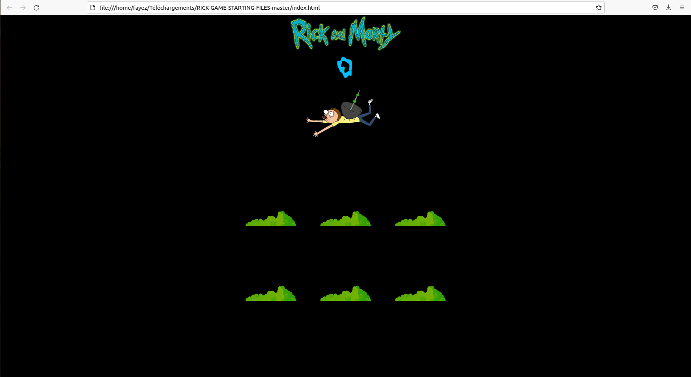
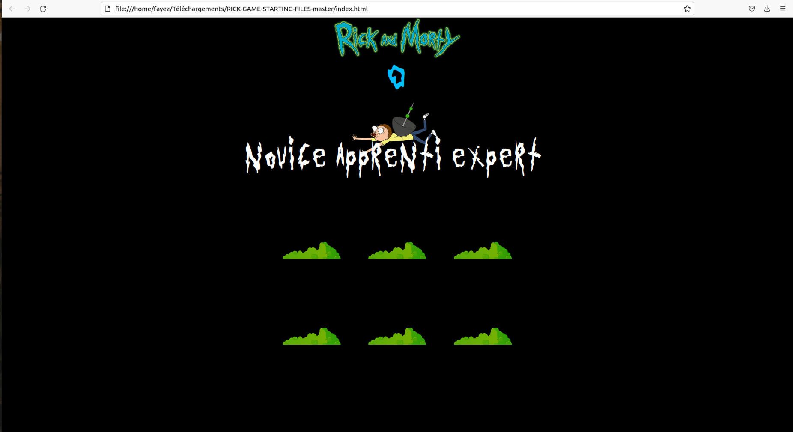
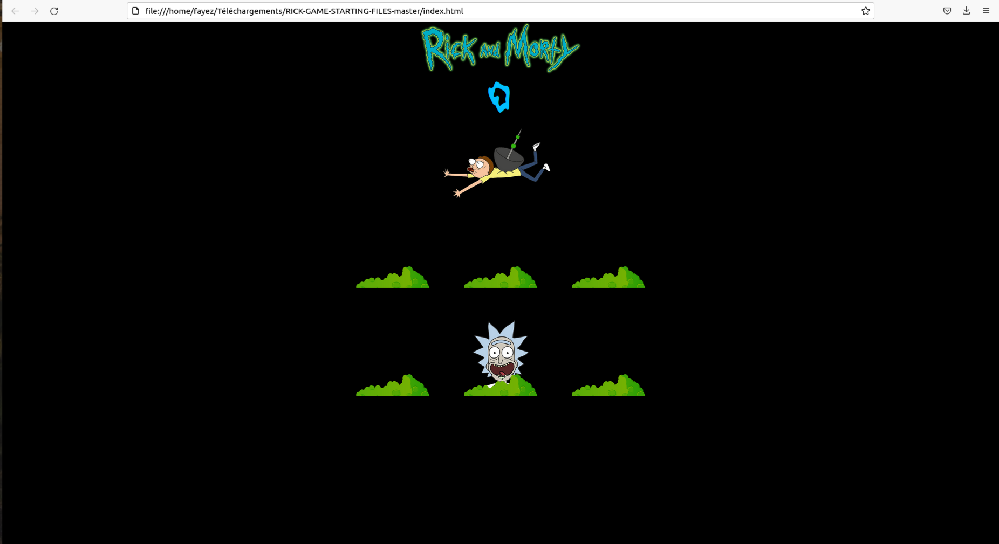
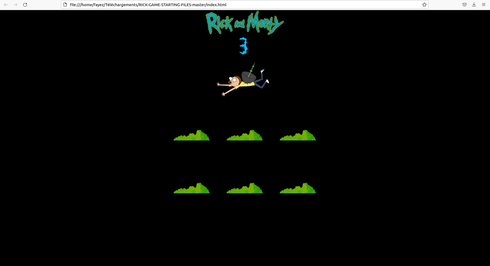
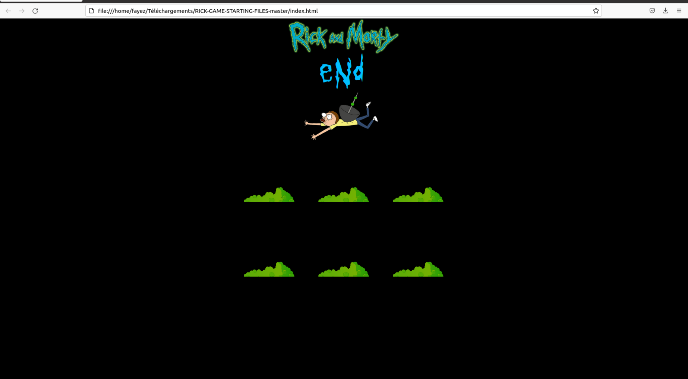

# Rick_and_Morty
Game in Javascript 
  
Clicking on the image to display the levels  
Choosing the level : Novice => normal  
                     Apprenti => medium  
                     Expert => height level  
  
Clicking on the head to increase the score  

  
Ater 10 seconds the game ends  
Dispaly the score at the end 

